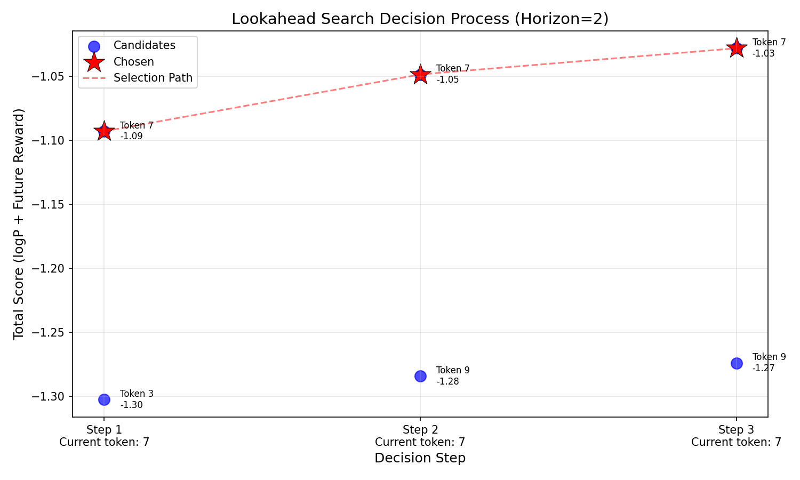

# Text Generation with MiniLM and Search Algorithms

This repository demonstrates text generation using a simple language model (MiniLM) combined with different search algorithms (Best-of-N, Beam Search, Lookahead Search) and a reward model (PRM). The implementation includes visualization of the search processes.
The associated mathematical formula can be found here:
## Features

- **MiniLM**: A lightweight language model with LSTM layers for sequence generation.
- **PRM (Proximal Reward Model)**: A neural network that scores generated sequences based on learned rewards.
- **Search Algorithms**:
  - **Best-of-N Sampling**: Selects the best candidate from N generated samples.
  - **Beam Search**: Maintains multiple top candidates during generation.
  - **Lookahead Search**: Simulates future steps to optimize token selection.
- **Visualization**: Generates PNG images showing search decision processes.

## Requirements

- Python 3.7+
- PyTorch
- NumPy
- Matplotlib
- NetworkX

Install dependencies:
```bash
pip install torch numpy matplotlib networkx
```

## Usage

1. **Clone the repository**:
   ```bash
   git clone https://github.com/yourusername/minilm-search-demo.git
   cd minilm-search-demo
   ```

2. **Run the demo script**:
   ```bash
   python test_with_graphs.py  # Rename the file if needed
   ```

3. **Generated Outputs**:
   - `best_of_n.png`: Bar chart comparing candidate token scores.
   - `beam_search_tree.png`: Graph showing beam search paths.
   - `lookahead_decision.png`: Decision process visualization for lookahead search.

## Code Structure

- `MiniLM` class: Implements the language model.
- `PRM` class: Implements the reward model.
- Test functions:
  - `test_prm_training()`: Trains the PRM model.
  - `test_best_of_n()`: Demonstrates Best-of-N sampling.
  - `beam_search()`: Visualizes beam search.
  - `lookahead_search()`: Demonstrates multi-step lookahead.

## Example Outputs

  
*Comparison of candidate tokens using PRM scores*

  
*Beam search visualization (width=2)*

  
*Decision points in lookahead search (horizon=2)*

## Contributing

Contributions are welcome! Please open an issue or submit a pull request.


## Blog
https://blog.csdn.net/2303_79071981/article/details/147016903?spm=1001.2014.3001.5502

